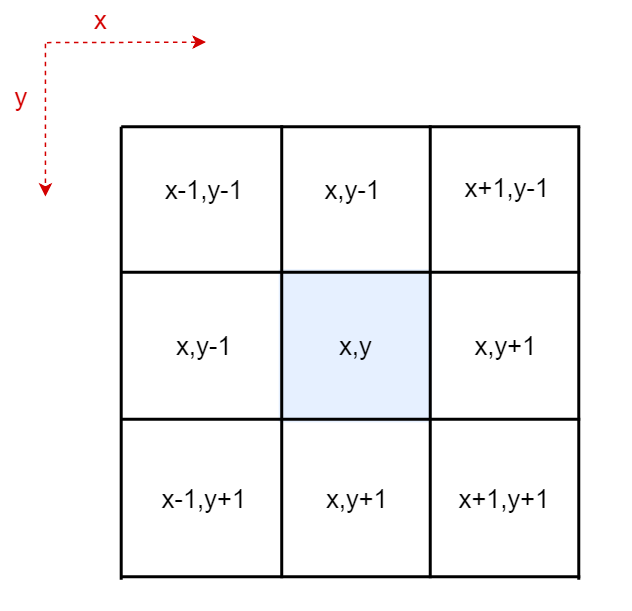

# Tiles

Cool little animation builder.

**TODO**:

1.  Finish documentation
2.  Make app smaller and host it to avoid having to run a local build
3.  Styling

# Contents

1.  [Concept](#concept)
2.  [Setup](#setup)
3.  [API](#api)
    3.1. [Tile Surface](#tile-surface)
    3.2. [Registering an Animation](#registering-an-animation)
    3.3. [Animation Function](#animation-function)
    3.4. [Event Object](#event-object)
    3.5. [Tile Object](#tile-object)

# Concept

The module is composed of two elements: the tile-surface and the code-editor.

The tile-surface is composed of a series of tiles in a square grid. When any tile on the grid is clicked, that tile will flip.

In the code-editor you define a function that will be executed every time a tile is flipped: this function can do a number of things, including flipping other tiles! And so, we have the perfect conditions to create interesting patterns 👌.

**INSERT DIAGRAM HERE**

## Tile Surface

Every tile is a square with customisable dimensions. The exact width and height of the tiles are determined by the parameters set as the [boundary conditions](#boundary-conditions). If the tile currently being flipped has coordinates **x,y**, then the tiles surrounding it will have different coordinates depending on their relative distance from **x,y**.



**Figure B**

# Setup

Requirements:

1.  node
2.  yarn

Clone the repo

```
git clone https://github.com/kesupile/tiles.git
```

Install dependencies

```
yarn install
```

Start the application

```
yarn start
```

# API

## Registering an Animation

Register your animation function by calling `Tiles.register`.

```javascript
/** Define your animation function */
const myAnimation = (currentTile, event, colour) => {
  // awesome animation logic here ✨
};

/** Register your function */
Tiles.register(myAnimation);
```

## Animation Function

The animation function will be executed on every flip and should be used to calculate which tiles should be flipped next. This callback receives 3 arguments:

1.  `currentTile`: The tile currently being flipped
2.  `event`: The [event](#event-object) that triggered this animation

The `currentTile` colour will be set to whatever string is returned by the function.

```javascript
/**
 * This will set the colour of the tile that triggered the animation to "#b7b745"
 */
const myAnimation = () => "#b7b745";

Tiles.register(myAnimation);
```

## Event Object

Add some introductory information here...

### Properties and Methods

| key           | type     | return | description                                                                            |
| ------------- | -------- | ------ | -------------------------------------------------------------------------------------- |
| triggerCoords | `string` | N/A    | The x,y coordinates of the tile that was clicked to trigger the animation. Eg: `40,20` |

## Tile Object

Add some information explaining what a tile object is

### Properties and Methods

| key        | type     | return | description                                                                                                                                                                   |
| ---------- | -------- | ------ | ----------------------------------------------------------------------------------------------------------------------------------------------------------------------------- |
| neighbours | `object` | N/A    | A object with pointers to the tile objects that border the tile in question. The pointers are indexed according to their relative position to the tile in question (Figure B) |
